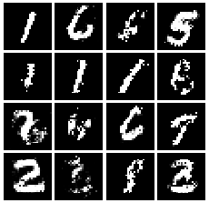
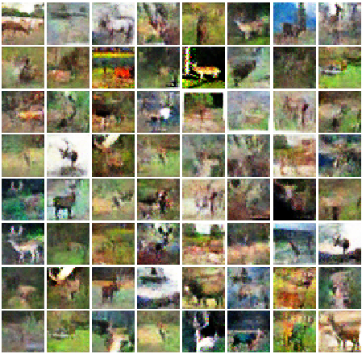
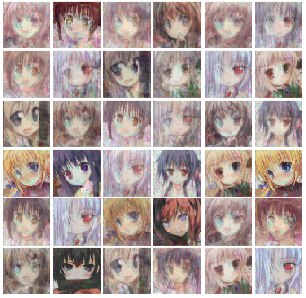

## NYU DS-3001 Machine Learning Project.
#Topic# Image_synthesis with DCGAN,WGAN,Relaxed WGAN

Collaborator: Lifan Wang,  Guanhua Chen,  Kuan Chen  

## Instruction
This project aimed to use cifar10, mnist, customized dataset to generate new images

Load the *.ipython file within each folder and reproduce the result. 

## Datasets
We built our PG-GAN model from MINST, CIFAR-10, Unknown dataset.   

## Results
The network would generate fake images during the training process, they are stored in the folders.  

Mnist:　　　　　　　　　　　　　Cifar10:　　　　　　　　　　　　Unknown:

